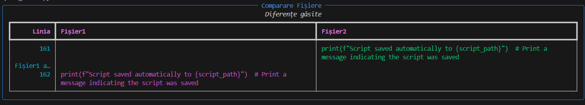

# Comparare Fișiere

Acesta este un proiect Python care compară două fișiere text linie cu linie și afișează diferențele într-o formă frumoasă folosind biblioteca `rich`. Diferențele sunt afișate într-un tabel interactiv în linia de comandă.

## Instalare

Pentru a rula acest proiect, asigură-te că ai Python instalat și că ai creat un mediu virtual.

- **compare_files.py** conține codul Python pe care l-ai furnizat.
- **generate.txt** și **generate1.txt** sunt fișierele de test care vor fi comparate.
- **requirements.txt** conține librăria `rich` necesară.
- **README.md** conține documentația pentru utilizatorii care vor utiliza sau contribui la proiect.

## Imagini

### Prezentare 1

